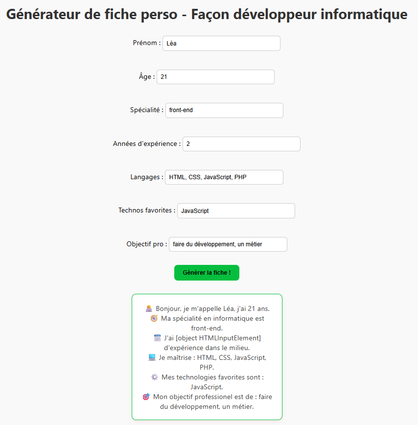

# 📄 Générateur de Fiche Perso 

Bienvenue dans mon projet HTML/CSS/JavaScript 🎉  
Ce petit outil simple mais efficace permet de créer une **fiche d'identité de développeur personnalisée** !
J'ai réalisé ce mini-projet dans le but de mobiliser mes compétences.

---

## 🛠️ Fonctions principales

### 🎨 Fiche de Développeur :
- Renseigner son prénom, âge, spécialité, années d'expérience, langages, technos favorites, objectif pro
- Générer une fiche lisible avec un design centré et épuré

---

## 🔍 Aperçu du projet

  

---

## 📁 Arborescence du projet

├── index.html
├── style.css
├── script.js
├── README.md
└── (optionnel) screen-fiche-developpeur.png

---

## 🚀 Comment l’utiliser

1. Clone ou télécharge ce repo  
2. Ouvre `index.html` dans ton navigateur  
3. Complète les champs  
4. Clique sur **"Générer la fiche"**  

---

## 📦 Tech utilisées

- HTML5
- CSS3
- JavaScript (vanilla)

---

## ✨ Idées d'amélioration

- 📱 Responsive mobile
- 🧩 Passage à React.js pour plus de dynamisme
- 🔐 Stockage local pour garder les données
- 🔥 Télécharger la fiche en PDF

---

## 👩‍💻 Auteur

**Léa**  
Développeuse alternante passionnée ✨  

---

## ☕ Bonus

Ce projet est un bon point de départ pour les débutants qui veulent :
- Pratiquer la manipulation DOM en JS
- Créer des interfaces web simples
- Apprendre à générer du contenu dynamiquement

---
